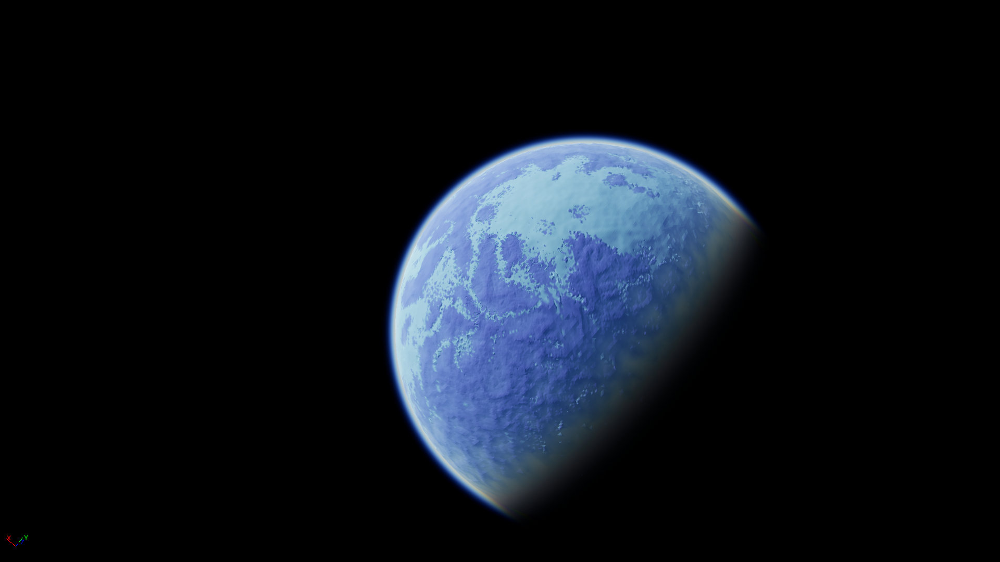
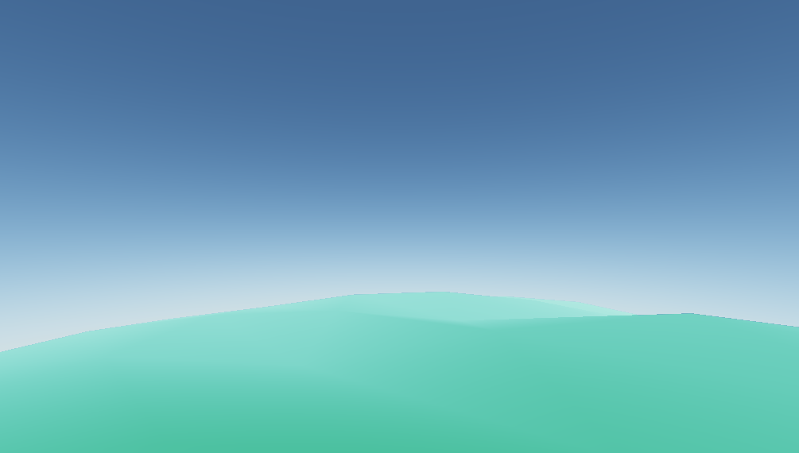

# Realistic-Atmosphere-Godot-and-UE4
A realistic atmosphere material for both the Godot game engine and Unreal Engine 4

(more in the images folder)

This resporitory provides code for adding realistic admospheres to godot and unreal engine 4.
The size, color and intensity can all be tuned.

For unreal engine 4, a project including all needed assets is given (for version 4.22.3)
For godot, a standalone shader file is given, as well as a demo project

### usage
The UE4 and Godot versions are used a bit differently, so I've created a seperate guide for them
usage guides are here:
[Godot](usage/godot.md) 

[UE4](usage/ue4.md)

The shadertoy verion can be found [here](https://www.shadertoy.com/view/wlBXWK), also by me.

The code is based on the [implementation by scratchapixel](https://www.scratchapixel.com/lessons/procedural-generation-virtual-worlds/simulating-sky), with a few modifications to make it work from space, and to make it look nicer

### license
The assets are shared under the MIT license, more detail in the LICENSE file.

If you use this in a game or other software, I'm fine with being credited with "Atmosphere by Dimas Leenman, Shared under the MIT license" somewhere in the credits.
